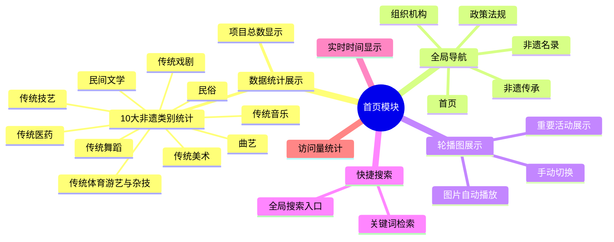
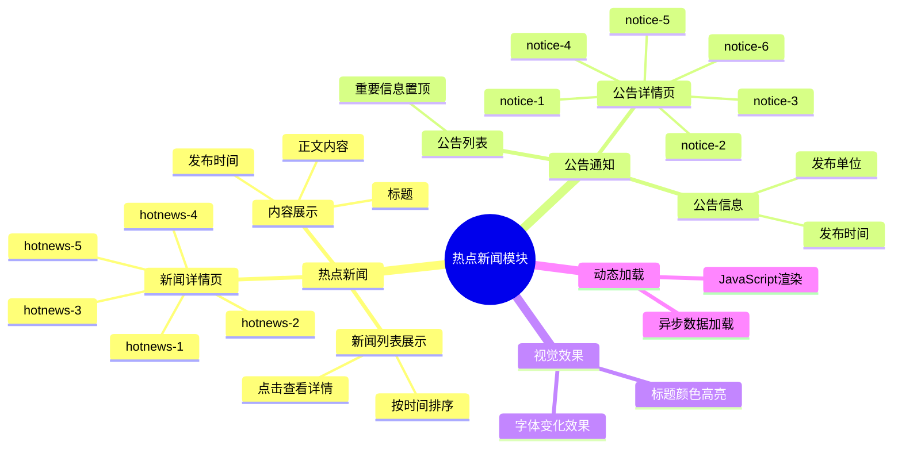
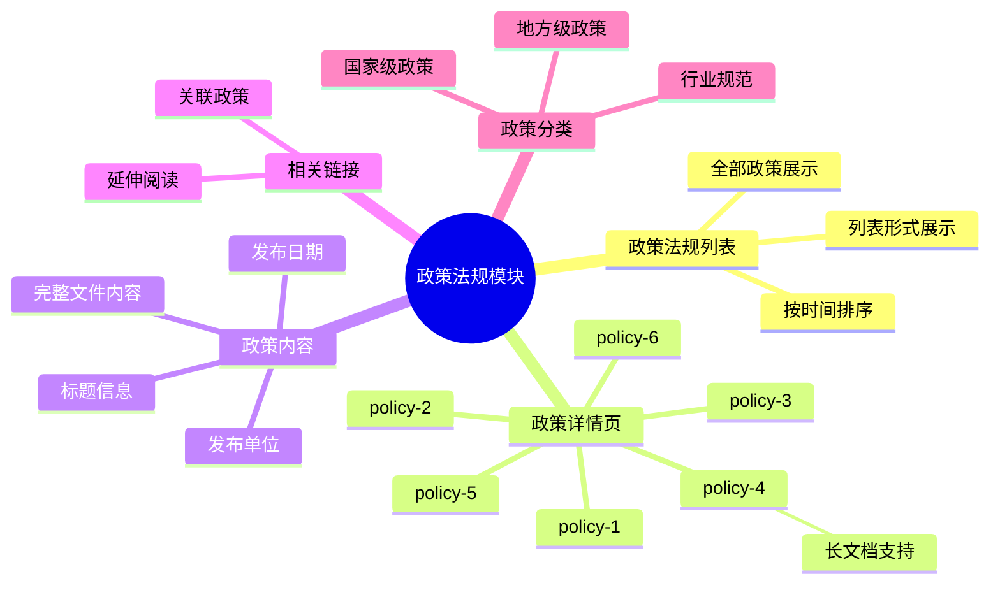
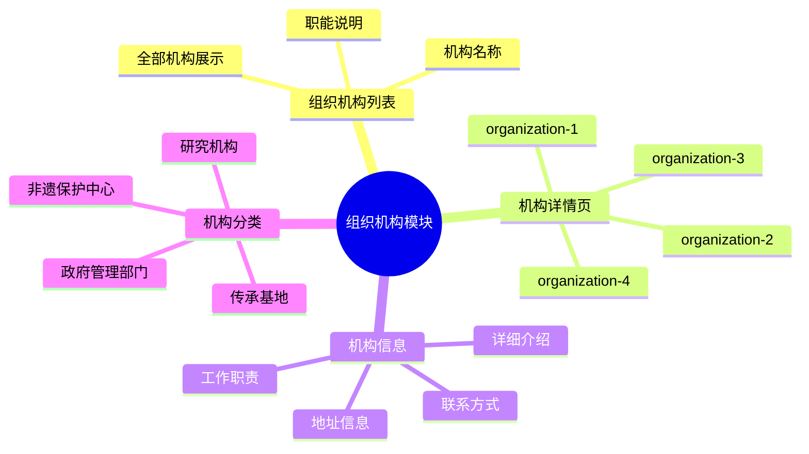
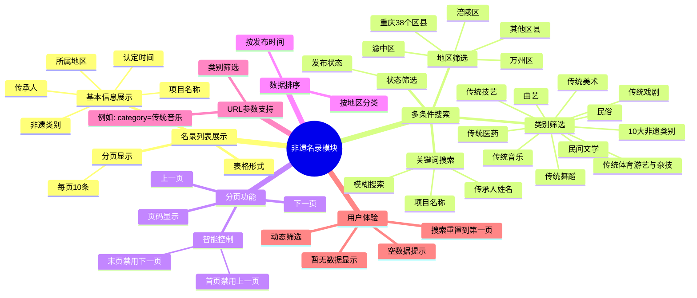
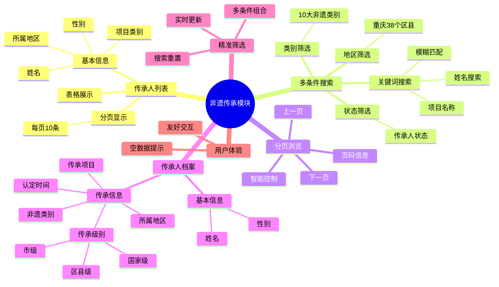
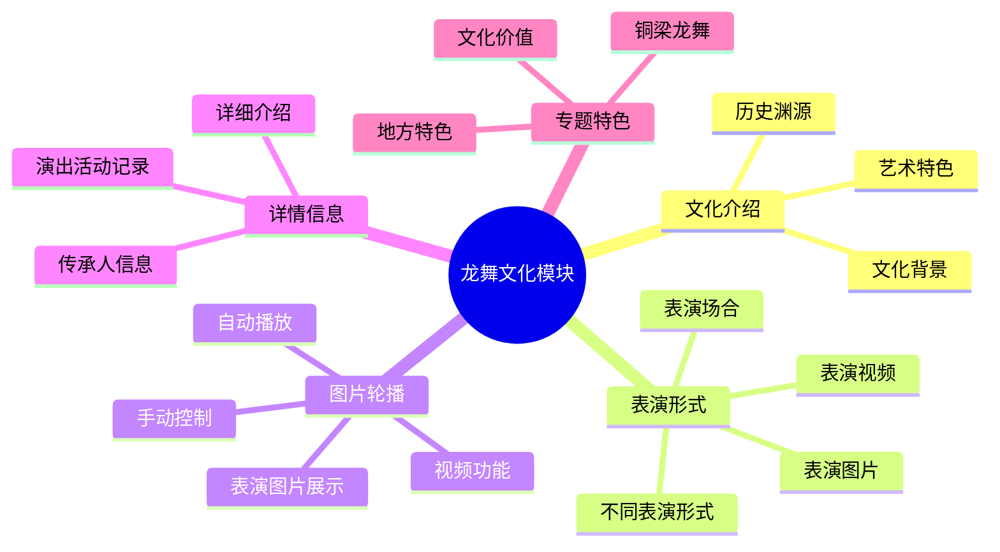
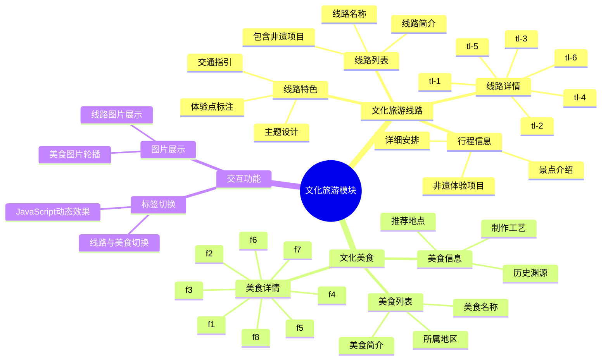
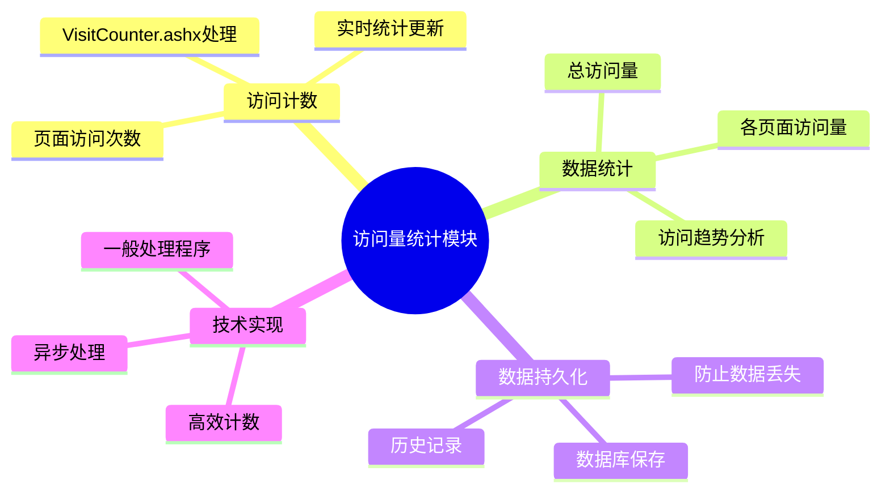

# CQFY 重庆非物质文化遗产网 - 功能模块详解

## 📌 模块总览

本项目是**重庆非物质文化遗产展示与管理平台**，包含 9 大核心功能模块，涵盖非遗项目的展示、查询、管理等全方位功能。

---

## 1️⃣ 首页模块 (Index)

### 📖 模块简介
系统门户首页，提供非遗项目总体概览、快速导航和数据统计展示，是用户了解重庆非遗文化的第一窗口。

### 🧠 功能思维导图

### ✨ 主要功能

- **📊 非遗数据统计展示**
  - 统计并展示 10 大非遗类别的项目数量
  - 类别包括：民间文学、传统音乐、传统舞蹈、传统戏剧、曲艺、传统体育游艺与杂技、传统美术、传统技艺、传统医药、民俗
  - 实时显示非遗项目总数

- **🧭 全局导航**
  - 提供所有功能模块的快速入口
  - 顶部导航栏包含：首页、组织机构、政策法规、非遗名录、非遗传承

- **🎨 轮播图展示**
  - 首页图片轮播，展示重要非遗活动或项目
  - 自动播放与手动切换功能

- **🔍 快捷搜索**
  - 提供全局搜索入口
  - 支持关键词快速检索

- **⏰ 实时时间显示**
  - 页面顶部显示当前系统时间

- **📈 访问量统计**
  - 记录并显示网站访问次数

---

## 2️⃣ 热点新闻模块 (HotNews)

### 📖 模块简介
展示重庆非遗相关的最新动态、新闻报道和重要公告，帮助用户及时了解非遗保护与传承的最新资讯。

### 🧠 功能思维导图

### ✨ 主要功能

- **📰 热点新闻列表**
  - 展示所有热点新闻
  - 按发布时间排序
  - 点击查看详情

- **📢 公告通知列表**
  - 发布官方公告和通知
  - 重要信息置顶显示
  - 公告详情查看

- **📄 新闻详情页面**
  - 5 个热点新闻详情页 (hotnews-1 ~ hotnews-5)
  - 完整的新闻内容展示
  - 包含标题、发布时间、正文内容

- **📋 公告详情页面**
  - 6 个公告详情页 (notice-1 ~ notice-6)
  - 公告详细内容展示
  - 发布时间、发布单位等信息

- **🔤 字体高亮**
  - 新闻标题颜色变化效果
  - 增强视觉引导

- **🔄 动态加载**
  - JavaScript 实现新闻列表动态渲染
  - 异步数据加载

---

## 3️⃣ 政策法规模块 (Policy)

### 📖 模块简介
集中展示国家及地方关于非物质文化遗产保护的法律法规、政策文件，为非遗工作者和爱好者提供政策参考。

### 🧠 功能思维导图

### ✨ 主要功能

- **📜 政策法规列表**
  - 展示所有政策法规文件
  - 按发布时间排序
  - 列表形式清晰展示

- **📄 政策详情页面**
  - 6 个政策法规详情页 (policy-1 ~ policy-6)
  - 完整的政策文件内容
  - 支持长文档展示（如 policy-4.aspx 达 3563 行）

- **🔗 相关链接**
  - 提供相关政策链接
  - 方便延伸阅读

- **📑 分类展示**
  - 国家级政策
  - 地方级政策
  - 行业规范

---

## 4️⃣ 组织机构模块 (Organization)

### 📖 模块简介
展示重庆非遗保护相关的政府机构、保护单位、传承基地等组织信息，方便用户了解非遗保护体系。

### 🧠 功能思维导图

### ✨ 主要功能

- **🏛️ 组织机构列表**
  - 展示所有相关组织机构
  - 包含机构名称、职能等信息

- **📋 机构详情页面**
  - 4 个机构详情页 (organization-1 ~ organization-4)
  - 机构详细介绍
  - 联系方式、地址等信息

- **🏢 机构分类**
  - 政府管理部门
  - 非遗保护中心
  - 传承基地
  - 研究机构

---

## 5️⃣ 非遗名录模块 (ProjectDirectory) ⭐核心模块

### 📖 模块简介
**核心功能模块**，展示重庆所有非物质文化遗产项目名录，提供强大的多条件筛选和搜索功能，是系统的核心数据展示平台。

### 🧠 功能思维导图

### ✨ 主要功能

- **📚 名录列表展示**
  - 分页显示非遗项目（每页 10 条）
  - 表格形式清晰展示
  - 显示项目基本信息

- **🔍 多条件高级搜索**
  - **地区筛选**：支持重庆 38 个区县筛选
    - 万州区、涪陵区、渝中区、大渡口区、江北区等
  - **类别筛选**：10 大非遗类别
    - 民间文学、传统音乐、传统舞蹈、传统戏剧、曲艺
    - 传统体育游艺与杂技、传统美术、传统技艺、传统医药、民俗
  - **状态筛选**：按发布状态筛选
  - **关键词搜索**：支持项目名称、传承人等关键词模糊搜索

- **📄 分页功能**
  - 上一页/下一页导航
  - 显示当前页码和总页数
  - 智能分页控制（首页禁用上一页，末页禁用下一页）

- **📊 数据排序**
  - 按发布时间排序
  - 按地区分类排序

- **🔗 URL 参数支持**
  - 支持通过 URL 参数直接筛选类别
  - 例如：`?category=传统音乐`

- **📭 空数据提示**
  - 无匹配数据时显示友好提示
  - "暂无数据"提示

- **🎯 动态筛选**
  - 筛选条件实时生效
  - 搜索后自动重置到第一页

---

## 6️⃣ 非遗传承模块 (Inheritor) ⭐核心模块

### 📖 模块简介
**核心功能模块**，展示非物质文化遗产代表性传承人信息，包括国家级、市级、区县级传承人，提供详细的传承人档案查询。

### 🧠 功能思维导图

### ✨ 主要功能

- **👤 传承人列表展示**
  - 分页显示传承人信息（每页 10 条）
  - 表格形式展示
  - 显示传承人基本信息

- **🔍 多条件高级搜索**
  - **地区筛选**：支持重庆 38 个区县
  - **类别筛选**：10 大非遗类别
  - **状态筛选**：按传承人状态筛选
  - **关键词搜索**：支持姓名、项目名称等关键词搜索

- **📄 分页浏览**
  - 上一页/下一页导航
  - 页码信息显示
  - 智能分页控制

- **📋 传承人信息展示**
  - 传承人姓名
  - 性别
  - 所属地区
  - 非遗项目类别
  - 传承项目名称
  - 传承级别（国家级/市级/区县级）
  - 认定时间

- **🎯 精准筛选**
  - 多条件组合筛选
  - 筛选结果实时更新
  - 搜索后自动跳转到第一页

- **📭 空数据友好提示**
  - 无匹配传承人时显示提示

---

## 7️⃣ 龙舞文化模块 (Dragondance)

### 📖 模块简介
专门展示重庆龙舞文化（铜梁龙舞等）的专题模块，包括龙舞历史、表演形式、传承情况等信息。

### 🧠 功能思维导图

### ✨ 主要功能

- **🐉 龙舞文化介绍**
  - 龙舞历史渊源
  - 文化背景介绍
  - 艺术特色说明

- **🎭 表演形式展示**
  - 不同龙舞表演形式
  - 表演视频/图片展示
  - 表演场合介绍

- **📸 图片轮播**
  - 龙舞表演图片展示
  - 带视频功能的图片切换
  - 自动播放与手动控制

- **ℹ️ 详情信息**
  - 龙舞详细信息页面
  - 传承人信息
  - 演出活动记录

---

## 8️⃣ 文化旅游模块 (CultureTour)

### 📖 模块简介
结合非遗文化与旅游，展示重庆非遗文化旅游线路和特色美食，推动非遗与旅游融合发展。

### 🧠 功能思维导图

### ✨ 主要功能

#### 8.1 文化旅游线路

- **🗺️ 旅游线路列表**
  - 展示所有非遗文化旅游线路
  - 线路名称、简介
  - 包含的非遗项目

- **📄 线路详情页面**
  - 6 个线路详情页 (tl-1 ~ tl-6)
  - 详细行程安排
  - 景点介绍
  - 非遗体验项目

- **🎯 线路特色**
  - 主题线路设计
  - 非遗体验点标注
  - 交通路线指引

#### 8.2 文化美食

- **🍜 美食列表**
  - 展示非遗美食项目
  - 美食名称、简介
  - 所属地区

- **📄 美食详情页面**
  - 8 个美食详情页 (f1 ~ f8)
  - 美食历史渊源
  - 制作工艺介绍
  - 推荐品尝地点

- **🔄 标签切换**
  - 旅游线路与美食标签切换
  - JavaScript 动态切换效果

- **📸 图片展示**
  - 美食图片轮播
  - 线路图片展示

---

## 9️⃣ 访问量统计模块 (VisitCounter)

### 📖 模块简介
后台统计模块，记录和分析网站访问数据，为运营决策提供数据支持。

### 🧠 功能思维导图

### ✨ 主要功能

- **📊 访问计数**
  - 记录页面访问次数
  - 实时统计更新
  - 使用 VisitCounter.ashx 处理

- **📈 数据统计**
  - 总访问量统计
  - 各页面访问量统计
  - 访问趋势分析

- **💾 数据持久化**
  - 访问数据保存到数据库
  - 防止数据丢失

---

## 🎯 模块功能对比表

| 模块名称 | 数据展示 | 高级搜索 | 分页 | 详情页面 | 筛选维度 |
|---------|---------|---------|------|---------|---------|
| 首页 | ✅ 统计 | ❌ | ❌ | ❌ | - |
| 热点新闻 | ✅ 列表 | ❌ | ❌ | ✅ 11个 | - |
| 政策法规 | ✅ 列表 | ❌ | ❌ | ✅ 6个 | - |
| 组织机构 | ✅ 列表 | ❌ | ❌ | ✅ 4个 | - |
| **非遗名录** | ✅ 表格 | ✅ | ✅ | ❌ | 4维筛选 |
| **非遗传承** | ✅ 表格 | ✅ | ✅ | ❌ | 4维筛选 |
| 龙舞文化 | ✅ 图文 | ❌ | ❌ | ✅ 1个 | - |
| 文化旅游 | ✅ 图文 | ❌ | ❌ | ✅ 14个 | - |
| 访问统计 | ✅ 计数 | ❌ | ❌ | ❌ | - |

---

## 🔧 技术实现特点

### 前端技术
- **ASP.NET Web Forms** - 服务器端控件
- **Repeater 控件** - 数据列表绑定
- **DropDownList** - 下拉筛选
- **JavaScript/jQuery** - 前端交互
- **CSS3** - 响应式布局

### 后端技术
- **三层架构** - BLL/DAL/Model 分离
- **分页算法** - Skip/Take 内存分页
- **多条件查询** - 动态 SQL 拼接
- **ViewState** - 页码状态保持

### 数据库
- **SQL Server Express** - 关系型数据库
- **ichProject 表** - 非遗项目数据
- **inheritor 表** - 传承人数据
- **hotnews 表** - 新闻数据

---

## 📱 用户角色与功能权限

### 普通用户
- ✅ 浏览所有公开信息
- ✅ 使用搜索和筛选功能
- ✅ 查看详细内容
- ✅ 访问文化旅游信息

### 管理员（后台，未在当前代码中体现）
- 🔒 新闻公告发布
- 🔒 非遗项目维护
- 🔒 传承人信息管理
- 🔒 数据统计分析

---

## 🚀 模块扩展建议

1. **非遗名录模块**
   - 增加地图可视化展示
   - 添加项目对比功能
   - 导出 Excel/PDF 功能

2. **非遗传承模块**
   - 传承人时间轴展示
   - 师徒关系图谱
   - 传承活动日历

3. **文化旅游模块**
   - 在线预订功能
   - GPS 导航集成
   - 用户评价体系

4. **通用功能**
   - 用户登录/注册
   - 收藏功能
   - 分享功能
   - 评论互动

5. **数据分析**
   - 访问热力图
   - 热门项目排行
   - 搜索词统计

---

## 📊 数据规模统计

| 数据类型 | 估计数量 | 说明 |
|---------|---------|------|
| 非遗项目 | 数百项 | 涵盖 10 大类别，38 个区县 |
| 传承人 | 数百人 | 国家/市/区县级传承人 |
| 新闻公告 | 17+ 条 | 热点新闻 + 公告通知 |
| 政策法规 | 6+ 条 | 国家及地方政策 |
| 组织机构 | 4+ 个 | 保护单位和管理机构 |
| 旅游线路 | 6 条 | 主题旅游线路 |
| 文化美食 | 8 个 | 非遗美食项目 |

---

## 🎨 UI/UX 特色

- **中国风设计** - 传统文化元素融入
- **响应式布局** - 适配不同屏幕
- **图标字体** - IconFont 图标库
- **动态效果** - 轮播、切换、高亮
- **面包屑导航** - 清晰的路径指示
- **统一风格** - 公共 CSS 样式库

---

## 📝 总结

CQFY 重庆非物质文化遗产网是一个**功能完善、架构清晰**的非遗文化展示平台，通过 9 大模块全面展示重庆非遗文化的各个方面。其中**非遗名录**和**非遗传承**是两个核心模块，提供了强大的多条件筛选和搜索功能，方便用户快速定位感兴趣的非遗项目和传承人。

系统采用经典的**三层架构**设计，代码结构清晰，易于维护和扩展，为重庆非遗文化的数字化保护和传播提供了有力的技术支撑。
